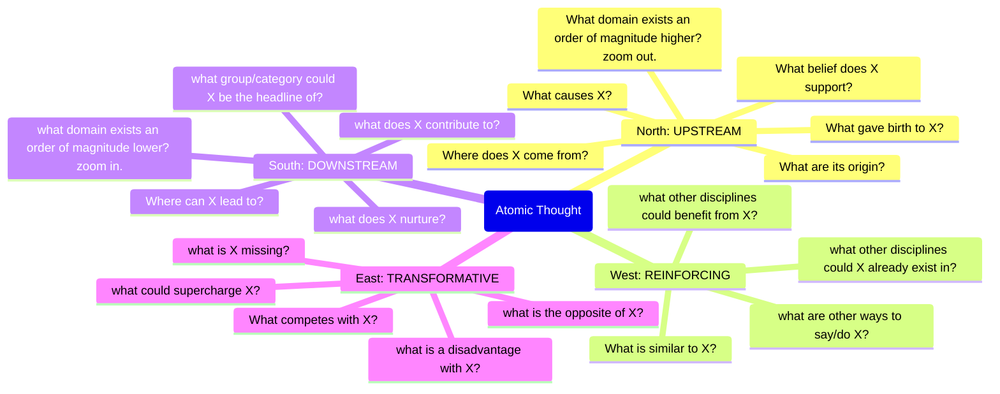

---
{"dg-publish":true,"permalink":"/thinking/zettels/1-a1-d-compass-of-thoughts-can-generate-ideas-or-connections/","noteIcon":"","created":"2025-04-22T14:50","updated":"2025-05-30T18:08"}
---

Thinking about where an atomic thought fits on a metaphoric directional compass can be useful. The compass may help source other ideas that are related, that you may otherwise not have considered without asking the questions. The compass may also get you to consider a new idea that relates to the atomic thought you are reflecting on. 

**source**:: [[Thinking/Reference/@zhaoCompassZettelkastenThinking\|@zhaoCompassZettelkastenThinking]]

**Prev**:: [[Thinking/Zettels/(1A1) Writing Depends Upon Your Ability To Read\|(1A1) Writing Depends Upon Your Ability To Read]]

**example**:: [[Resources/Defining Personal Ontology\|Defining Personal Ontology]]

#zettel/need-analog 